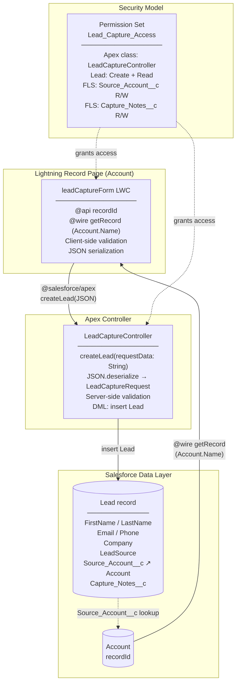

# Lead Capture Form — Solution Documentation

Feature: `002-lead-capture-form`  
API Version: LWC 63.0 / Salesforce source 66.0

---

## Architecture Diagram



---

## Component Architecture

### `leadCaptureForm` LWC

Located at [force-app/main/default/lwc/leadCaptureForm/](../force-app/main/default/lwc/leadCaptureForm/)

| File                          | Purpose                                                           |
| ----------------------------- | ----------------------------------------------------------------- |
| `leadCaptureForm.html`        | Form template — two-column responsive grid via `lightning-layout` |
| `leadCaptureForm.js`          | Controller — state, wire adapter, validation, Apex call           |
| `leadCaptureForm.css`         | Notes character counter styling                                   |
| `leadCaptureForm.js-meta.xml` | Component metadata — exposed on Account record pages              |

**Key responsibilities:**

- Receives `recordId` via `@api` property (injected by the record page).
- Wires `getRecord` to read `Account.Name` and pre-populate the Company field.
- Tracks `formData` as a spread-copied plain object; each field change produces a shallow clone to trigger reactivity.
- `validateForm()` runs client-side checks (required fields, email regex, notes length ≤ 500) before any server call.
- Serialises the payload to JSON and calls `LeadCaptureController.createLead` imperatively.
- Shows `ShowToastEvent` on success (with the new Lead's display name) or failure.
- Resets the form on success, preserving the auto-populated Company value.

---

## Data Flow

```
User fills form
    │
    ▼
handleSubmit()
    │  client-side validateForm()
    │  ├─ required field checks
    │  ├─ email regex
    │  └─ notes ≤ 500 chars
    │
    ▼  (invalid → toast error, abort)
JSON.stringify(leadParam)
    │
    ▼
createLead({ requestData }) ── Apex boundary ──▶ LeadCaptureController.createLead()
                                                      │
                                                      │  JSON.deserialize → LeadCaptureRequest
                                                      │
                                                      │  validateRequest()
                                                      │  ├─ null checks
                                                      │  ├─ required field checks
                                                      │  ├─ email regex
                                                      │  ├─ allowedSources whitelist
                                                      │  └─ notes ≤ 500 chars
                                                      │
                                                      ▼  (invalid → AuraHandledException)
                                                   insert Lead
                                                      │
                                                      ▼
                                              LeadCaptureResponse
                                              { leadId, leadName }
    ◀──────────────────────────────────────────────────┘
    │
    ▼
Success toast  →  form reset (Company preserved)
```

**Validation is intentionally duplicated** at both layers: client-side for immediate UX feedback, server-side for data integrity (the controller enforces correctness regardless of caller).

---

## Security Model

### Permission Set — `Lead_Capture_Access`

Assigned to users who need access to the feature. Grants the minimum permissions required.

| Layer                          | Grant        | Details                         |
| ------------------------------ | ------------ | ------------------------------- |
| Apex class                     | Execute      | `LeadCaptureController`         |
| Object (Lead)                  | Create, Read | No Edit, No Delete, no View All |
| FLS — `Lead.Source_Account__c` | Read + Write | Custom lookup to Account        |
| FLS — `Lead.Capture_Notes__c`  | Read + Write | Long text area, 500 chars       |

### Controller sharing model

`LeadCaptureController` is declared `with sharing`, so Salesforce record-level sharing rules are enforced. A user without Read access to the Account record cannot successfully call `getRecord` in the LWC (the wire error branch fires instead).

### What the permission set does NOT grant

- Edit or Delete on Lead records — captures are write-once from this form.
- FLS on standard Lead fields (`FirstName`, `LastName`, `Email`, `Phone`, `Company`, `LeadSource`) — these are standard fields covered by the object-level permission or the user's profile.
- View All Records on Lead — users see only Leads they own unless sharing rules grant more.

---

## Data Model

### Custom fields on `Lead`

| Field API Name      | Type             | Label          | Notes                                                                  |
| ------------------- | ---------------- | -------------- | ---------------------------------------------------------------------- |
| `Source_Account__c` | Lookup (Account) | Source Account | `deleteConstraint = SetNull`; relationship name `Source_Account_Leads` |
| `Capture_Notes__c`  | Long Text Area   | Capture Notes  | 500 chars, 5 visible lines                                             |

### Field mapping — form → Lead record

| Form field               | Lead standard field | Required                                                     |
| ------------------------ | ------------------- | ------------------------------------------------------------ |
| First Name               | `FirstName`         | No                                                           |
| Last Name                | `LastName`          | Yes                                                          |
| Email                    | `Email`             | Yes                                                          |
| Phone                    | `Phone`             | No                                                           |
| Company (auto-populated) | `Company`           | Yes                                                          |
| Lead Source              | `LeadSource`        | Yes — whitelist: Web, Phone Inquiry, Partner Referral, Other |
| Notes                    | `Capture_Notes__c`  | No                                                           |
| _(record page context)_  | `Source_Account__c` | Yes (injected via `recordId`)                                |

---

## Deployment

```bash
# Deploy all feature metadata
sf project deploy start --source-dir force-app

# Assign permission set to a user
sf org assign permset --name Lead_Capture_Access --target-org <alias>

# Run Apex tests
sf apex run test --test-level RunLocalTests --output-dir test-results --result-format human

# Run LWC Jest tests
npm run test:unit
```
